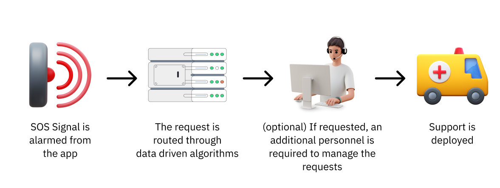

# AI Integration Possibility

## Transitioning to Predictive and Algorithmic SOS Management

Currently, the entire SOS (Save Our Souls) system—from initial call reception to resource deployment—is overseen and supervised almost entirely by manual human intervention. While this ensures essential human judgment is involved, it inherently introduces a significant drawback: a measurable latency in response time. In the high-stakes environment of an emergency, where every single second truly counts, this human processing time—the moment taken to assess, categorize, and dispatch resources—is a critical bottleneck.

Hence, there is a pressing, fundamental need for a strategic shift: the introduction of data-driven algorithms and machine learning models. These advanced algorithms would provide a necessary intervention, operating seamlessly behind the scenes to predict the severity, type, and location of the emergency, and to immediately categorize them beforehand. By rapidly analyzing incoming data streams (such as location, reported keywords, prior incident history, and available resource status), the system can instantly determine the most appropriate response pathway and route them safely and efficiently without waiting for manual assessment.

This hybrid method—where algorithmic speed supports human oversight—ensures that the system is functioning at peak efficiency. It guarantees that each second is utilized effectively in the service of saving lives, recognizing the brutal reality that each second wasted is a life potentially lost. This transition moves the system from a reactive, human-paced model to a proactive, machine-optimized rapid deployment model.

## Prioritizing Local and Immediate Emergency Response

For emergencies, the system is designed to immediately prioritize and direct available assistance from the most locally positioned and readily accessible personnel—specifically, EMTs (Emergency Medical Technicians) and Certified First-Aid Responders. This initial, rapid response is absolutely crucial; it ensures that immediate, life-saving interventions can begin within that critical "golden hour," often right where the incident occurs.

These local responders, who possess essential hands-on training and knowledge of the immediate area, serve as the front line of defense. They are empowered to manage the situation and stabilize the patient first. Crucially, only then, in cases of a severe injury or complex health issues that exceed their immediate capabilities, are they tasked with requesting backup for high-risk jobs from the central system. This tiered approach prevents system overload and ensures that limited, highly specialized resources are only deployed when genuinely needed, maximizing the speed and efficiency of the overall emergency service delivery.

## Manual Intervention in Key Areas for Enhanced Safety

At designated critical areas, the overarching system philosophy is to prioritize manual interventions and direct human oversight rather than relying purely on automation. This decision is a deliberate and essential safeguard, implemented specifically to prevent any room for error.

While automation offers speed and efficiency in many operational contexts, it inherently lacks the nuanced judgment, adaptability, and ethical oversight that a trained human operator can provide—especially when dealing with sensitive, high-consequence tasks or equipment. By insisting on a human-in-the-loop approach in these zones, the system actively mitigates the risks associated with unforeseen software bugs, sensor failures, or environmental factors that could otherwise lead to a catastrophic systemic failure. It’s a commitment to placing human scrutiny and proven procedural knowledge above the inherent vulnerabilities of complex automated algorithms.

<figure><figcaption></figcaption></figure>
